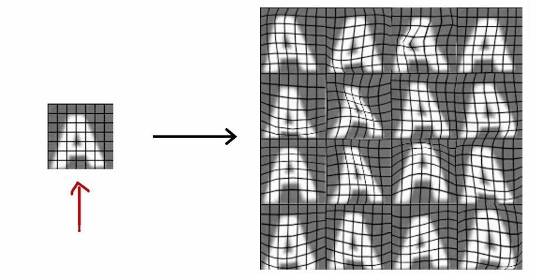

# 模型开发基础

## 机器学习的开发迭代过程

通常在开发一个机器学习模型的过程中，首先要选择架构，包括整个机器学习算法的模型、数据集等。接着，通过
数据集进行模型训练，不过模型训练的结果并不会一直都符合期望。所以，需要在模型训练后对模型预测效果进行
诊断，根据诊断的问题重新调整数据集、模型特征等，然后再循环整个过程，最终让机器学习算法的模型符合我们
的期望。

我们先来看下面的垃圾邮件的示例，左侧是一封销售商品的电子邮件，另一位是家人发送的正常邮件。可以通过将
一些单词（例如垃圾邮件高频出现的 1000 个单词）作为特征值，当存在时记为 1（或该词出现的次数），未出现
该词时记为 0。基于这些特征值，便可以训练一个分类算法（例如一个逻辑回归模型或神经网络模型）对是否为垃
圾邮件进行判断。

当然，在初次训练后模型可能不尽如人意，我们会通过一些手段对模型调整，例如如下的几种方式：
- 收集更多数据进行训练
- 根据邮件路由开发更多的分类特征，例如根据邮件头信息判断是否垃圾邮件
- 对邮件内容定义更多的特征，例如同一单词的不同时态等
- 设计算法识别错误拼写的单词（一些垃圾邮件会通过单词的错误拼写避免被拦截）

接着一直进行这个训练模型的循环，直到训练得到理想的模型。

## 误差分析

根据以往的经验，我们知道训练得到的模型要满足需求，需要经过多次分析模型结果的误差，再针对不理想的部分进
行训练，最终才能得到理想的模型，此时误差分析的步骤显得格外重要。

继续以前面提到的垃圾邮件分类作为示例，例如现在训练的模型交叉验证集中（500 封邮件）进行分类，其中有 100 
封分类错误。包含有几种主要的错误情况，分别是药物类垃圾邮件（27 封）、异常的邮件路由（9 封）、密码盗取类
邮件（17 封）、图片式的垃圾邮件（3 封）、错误拼写式垃圾邮件（5 封）。

这些主要的分类错误可能是交集的，也就是说一封分类错误的垃圾邮件，可能同时存在几种主要的分类错误情况，它们
并不互斥。根据上面统计的邮件分类错误情况来看，分类错误最多的情况是药物类的垃圾邮件和密码盗取类的垃圾邮件，
它们都是较缺少这两种垃圾邮件训练数据导致的，可以通过收集更多的邮件数据进行训练解决。而之前我们设想的，通
过增加邮件路由特征和识别错误拼写特征提高模型的垃圾邮件分类能力，收益并不高，所以通过这种误差分析方法，能
够提出更加有效的模型训练改善方法。

当然，我们通常遇到的情况数据集会比上述例子中的更加庞大。例如，交叉验证集有 10000 封，分类错误的邮件有 500 
封，我们是无法有精力将 500 封邮件都检查一遍，所以只能在 500 封邮件中随机抽取 100 封，按照前面所讲误差分析
方式进行统计，并选取有效方式训练模型。

## 增加数据

当我们需要解决模型训练不足的问题时，通常是去下载已经公开的数据集，或在网络上查找相关数据自己整理为数据集，
不过这样得到的数据往往缺乏针对性，无法针对模型的误差缺陷进行训练。对于这种情况我们要介绍两种增加数据的方
式，一种是数据增强，另一种是数据合成。

对于一个识别字母 A 的模型，我们很容易找到标准的字母 A 的图片训练模型。但对于其他变形状态下的字母 A 就难以
识别，所以我们可以针对这种情况，在标准字母 A 的图片基础上对图像做各种角度的旋转和扭曲，再将这样的训练集用
于模型训练，最终我们能够得到一个健壮的模型。

这种对现有训练数据样例进行修改，以形成新训练数据集样例的方式就是数据增强。但数据增强如果进行随机干扰，生成
的数据集效果并不好。比如对字母 A 的图片每个像素添加噪音，在像素明度上进行随机调整，生成的数据集结果对模型
训练并没有针对性，或者这些情况就不是当前模型要解决的问题中的常见情况，这种数据增强生成的数据集对于模型训练
帮助就不大。

除了图像外，对于音频训练数据集也可以使用数据增强，你可以为音频添加背景噪音，增加通话质量不佳情况下的断断续
续，也可以进行一些口音的变化等等，你同样也可以通过数据增强的方式获得更加有针对性，数据量更大的训练数据集。

除了数据增强外，我们还可以通过数据合成的方式制造数据集，数据合成就是通过人造数据创建训练数据集。例如 OCR 需
要识别图像中的各种文字，我们就可以将字母按照电脑中所有字体生成，再进行一些明暗光线的变化，最后生成一组数据
集，这组数据集就是数据合成的数据集。
